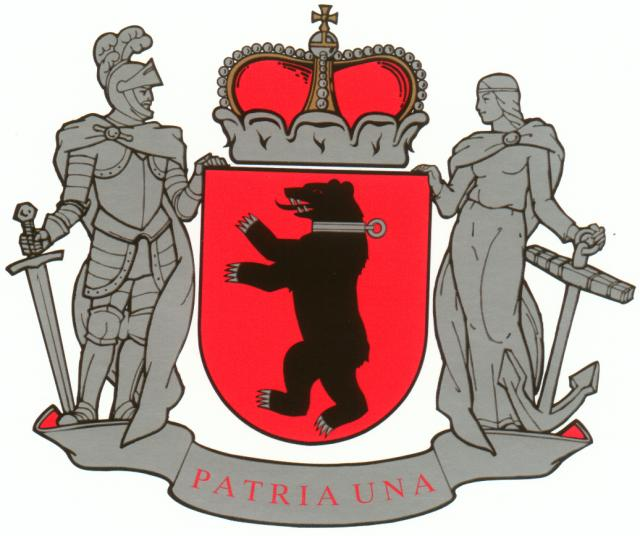

[BALTIC: the Backronymed Adaptable Lightweight Tree Import Code](https://github.com/blab/baltic/blob/master/BALTIC_treeParser.ipynb)

baltic was initially developed to extract various statistics from molecular phylogenies derived from [BEAST](https://github.com/beast-dev/beast-mcmc) in a customised way. My [influenza B virus reassortment paper](dx.doi.org/10.1093/molbev/msu287) used early versions of baltic’s code to look at how the human influenza B virus segment diversity is structured according to genomic background. I’ve since split up the various bits of code into three parts:

———————

## baltic
baltic.py is the tree parser itself. It uses three main classes - node, leaf and tree to import, manipulate and plot BEAST trees with their rich variety of comments. Node and leaf classes have references to the usual set of parameters you would find in a phylogeny - index of character in string designating the branch (a unique identifier within the tree), length, height, position in time (absoluteTime), X and Y coordinates, a dictionary encoding BEAST branch comments (traits) and a reference to their parent (None for root) and a string designating their type (branchType). The node class additionally have a children attribute, which is a list of the node’s children, another list called leaves that contains tip names that descend from that node, a numChildren attribute, which is the length of the leaves list and a childHeight attribute which tracks when the last tip descending from the node existed. The leaf class has two extra attributes called name and numName. Trees drawn from the posterior distribution will usually encode tips as numbers to save space and require a translation map to convert back into actual interpretable tip names. In baltic numName will be the exact name for the tip that was used in the tree string, with functions to allow the translation of numName into name.

baltic.py evolved from a [short linked list script on StackOverflow](http://stackoverflow.com/questions/280243/python-linked-list/280286#280286) and underwent a major overhaul in order to correct [an article](dx.doi.org/10.1126/science.aaa5646) that was wrong. The code should be fairly legible (and commented) and highly adaptable to suit anyone’s needs.

———————

## samogitia

samogitia.py is the heavy-lifting, tree file-wrangling script in the collection. It’s main role is to parse BEAST tree files, use baltic to create tree data structures, which samogitia then manipulates to create BEAST-like log files that can usually be imported into [Tracer](http://tree.bio.ed.ac.uk/software/tracer/) or used in another program.

——————

## austechia

austechia.ipynb is the fancy Jupyter notebook that takes tree files, usually MCC trees from BEAST, and plots them. It is meant to be part teaching tool to get people to think about how trees are plotted, to allow for highly customisable representations of trees (e.g. Fig 6 in my [MERS-CoV paper](http://dx.doi.org/10.1093/ve/vev023)) and to improve the aesthetics situation in phylogenetics.

—————

Copyright 2016 [Gytis Dudas](https://twitter.com/evogytis). Licensed under a [Creative Commons Attribution-NonCommercial-ShareAlike 4.0 International License](http://creativecommons.org/licenses/by-nc-sa/4.0/).